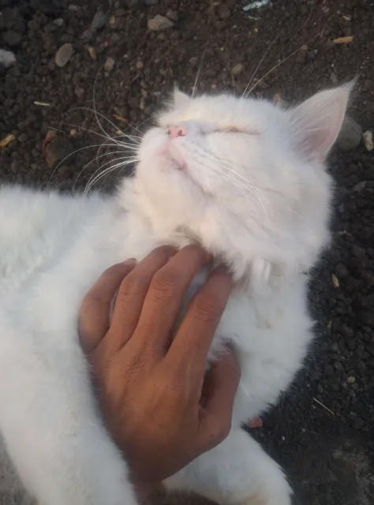

# Hello, I'm Raja Dodve
Software Developer | Memory Athlete

I build interactive software, web applications, CLI tools, and 3D web experiences.

## Projects

**[Krubiks](https://krubiks.pages.dev/)** - Interactive 3D training environment for blindfolded Rubik's Cube solving, combining method lessons, guided memo visualization, Speffz tracing, flashcards, and step-by-step execution.

**[Low-poly Farm](https://low-poly-farm.pages.dev/)** - Interactive 3D portfolio world with portals, day/night cycles, weather, a 3D library, and WASD exploration.

**[Clarity](https://clarity-475.pages.dev/)** - AI decision guide with curated question flows that teach you how to choose, not just what to buy.

**[Internals-X](https://internals-x.pages.dev/)** - Learn Git from the inside out by running real commands in a guided terminal and watching Git's object model come alive in 3D.

**[OtakuSen](https://github.com/IntrovertInsaan/OtakuSen)** - Full-featured media tracker for anime, manga, manhwa, manhua, games, movies, and more, with reviews, notes, favorites, achievements, profiles, search, and a real-time community forum.

**[decryptors](https://github.com/IntrovertInsaan/decryptors)** - CLI puzzle game where you decrypt hidden information through unconventional thinking.

**[pacwatch](https://github.com/IntrovertInsaan/pacwatch)** - Terminal UI for exploring your installed Arch Linux packages through custom categories, focused on understanding your system rather than managing it.

**[Cliajar](https://cliajar.pages.dev/)** - One hand-picked CLI tool per category. Curated, not ranked.

## Currently Building
Most of my current work is private and under active development.

**Railogy** *(Private)* - Interactive visual guide to Ruby on Rails architecture using analogies and a living 3D world.

## Internship Experience

**Programmer Intern | Remote | 2025**

Worked remotely under the mentorship of a senior software engineer on practical web development and production application work.

- Worked on assigned development issues, researching and learning the technologies and concepts needed to solve them
- Built web features using **HTML, CSS, JavaScript, and Astro**, while learning **Three.js through Three.js Journey** and applying it to interactive 3D web experiences
- Worked with **Ruby on Rails**, contributing to application development, testing, and production code
- Worked across **frontend, backend, databases, testing, and developer tooling** throughout the internship

## Stack

| Layer | Technologies |
|:---|:---|
| **Languages** | Ruby, Rust, Python, TypeScript |
| **Frontend** | Astro, React, Svelte, TailwindCSS |
| **Backend** | Ruby on Rails, Node.js, Hono |
| **3D & Graphics** | Three.js, React Three Fiber, Blender |
| **Database** | PostgreSQL, SQLite, Turso |
| **DevOps** | Linux, Docker, Nginx, Bash scripting, GitHub Actions |
| **Tooling** | Kitty, Neovim, Zsh, Git |

## Memory Athlete (6+ years)

Memory athlete, helping people discover what trained memory is capable of.

**Achievements**
- 80 random digits in 11s
- 100 random digits in 17.04s
- 111 spoken digits
- 52 cards in 19.39s
- 500+ binary digits in 2.5 min
- 100+ dates in 5 min
- Memorized 1,000 digits of π
- Blindfold Rubik's Cube (Sub-25s)

**Beyond Memory**
- Mental Math
- Calendar Calculations
- 120 WPM typing
- Speed Reading
- Chess: 1900+ (Lichess), 1700+ (Chess.com)

## Philosophy

Write systems that last.  
If you have to do it twice, automate it.  
Curiosity beats complexity.

## Personal

My favorite debugging assistant. 🐈

## Connect

- **Happy to chat about:** Memory Techniques, 3D Web Dev, anything about Ruby on Rails.
- **Reach me:** [rajadodve43@gmail.com](mailto:rajadodve43@gmail.com)
